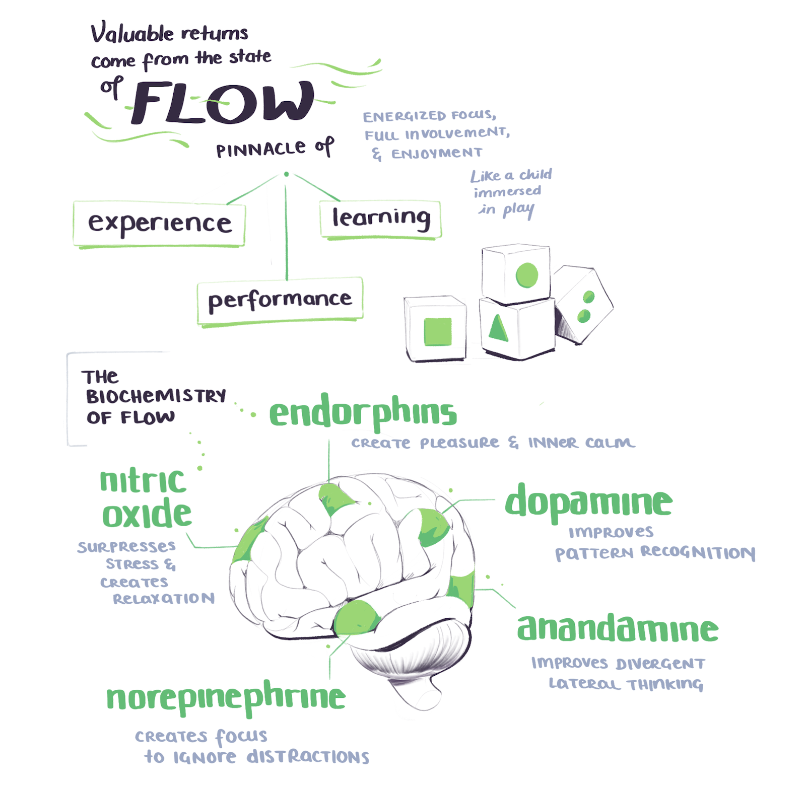

In September of 2019 I took a course called <Link to='https://www.buildingasecondbrain.com'>Building a Second Brain</Link> by <Link to='https://twitter.com/fortelabs'>Tiago Forte</Link>.

Much like it sounds, Building a Second Brain is about creating a reliable system – outside your physical skin-and-bone bodily boundaries – for storing, organising, digesting, and eventually transforming information into Good Creative Output. 

Much like any well-integrated tool, the mental distance between you and the system grows small.  
It's a lovely little closed feedback loop – <Link to="https://en.wikipedia.org/wiki/Cybernetics">a cybernetic system</Link>.  
At this point almost all of my daily workflow revolves around my second brain. Links, articles, books, papers, podcasts, and half-formed thoughts go in.  
These build into notes and develop over time – they merge, meander, and mature into talks and blog posts and illustrations.  
It is hard to remember what my workflow looked like without it.

For tools I'm currently using <Link to="https://roamresearch.com/">Roam Research</Link>, backed up by <Link to="https://www.keyboardmaestro.com/main/">Keyboard Maestro</Link> for some fancy automation elements.

These illustrated cover all the sections of the course. Enjoy!

---

<Image src="https://res.cloudinary.com/dg3gyk0gu/image/upload/c_scale,w_960/v1586173192/maggieappleton.com/basb/Basb1-4_2x.png" alt="Building a second brain (BASB) illustrated notes on the PARA system of organising content projects, areas, resources, and archives" />
<Image src="https://res.cloudinary.com/dg3gyk0gu/image/upload/c_scale,w_960/v1586173190/maggieappleton.com/basb/Basb1-2_2x.png" alt="BASB sketchnotes on putting projects in priority order and defining the desired outcome" />
<Image src="https://res.cloudinary.com/dg3gyk0gu/image/upload/c_scale,w_960/v1586173188/maggieappleton.com/basb/Basb1-1_2x.png" alt="BASB sketchnotes on wiping the slate clean and setting up PARA as a folder structure" />
<Image src="https://res.cloudinary.com/dg3gyk0gu/image/upload/c_scale,w_960/v1586173189/maggieappleton.com/basb/Basb1-3_2x.png" alt="BASB sketchnotes on creating metaplans before you start your project" />

---

<Image src="https://res.cloudinary.com/dg3gyk0gu/image/upload/v1586173064/maggieappleton.com/basb/Basb2-1_2x.png" alt="BASB sketchnotes on digital cognition and building a personal knowledge base" />

<Image src="https://res.cloudinary.com/dg3gyk0gu/image/upload/v1586173065/maggieappleton.com/basb/Basb2-2_2x.png" alt="BASB sketchnotes on your notes being unpolished, personal, open-ended, and diverse" />

<Image src="https://res.cloudinary.com/dg3gyk0gu/image/upload/v1586173061/maggieappleton.com/basb/Basb2-3_2x.png" alt="BASB sketchnotes on considering 12 favourite problems to focus on" />

---

<Image src="https://res.cloudinary.com/dg3gyk0gu/image/upload/v1586172896/maggieappleton.com/basb/Basb3-1_2x.png" alt="BASB sketchnotes on balancing discoverability with understanding in your notes" />
<Image src="https://res.cloudinary.com/dg3gyk0gu/image/upload/v1586172898/maggieappleton.com/basb/Basb3-2_2x.png" alt="BASB sketchnotes on putting your notes through 5 layers of progressive summarisation" />
<Image src="https://res.cloudinary.com/dg3gyk0gu/image/upload/v1586172894/maggieappleton.com/basb/Basb3-3_2x.png" alt="BASB sketchnotes on focusing on what resonates when summarising your notes" />

---

---

---
To be clear there's no affiliate links or kickback involved in these notes. 
I'm not being paid to say nice things about the course.  

Tiago's ideas and systems are just good.  
He thinks everything through in a way that feels rare on the insta-internet.

Hope it gave you a bit of insight into the BASB system.
There's plenty more to explore on Tiago's <Link to="https://praxis.fortelabs.co/">Forte Labs Blog</Link> and he's <Link to="https://twitter.com/fortelabs">good at tweeting</Link>.