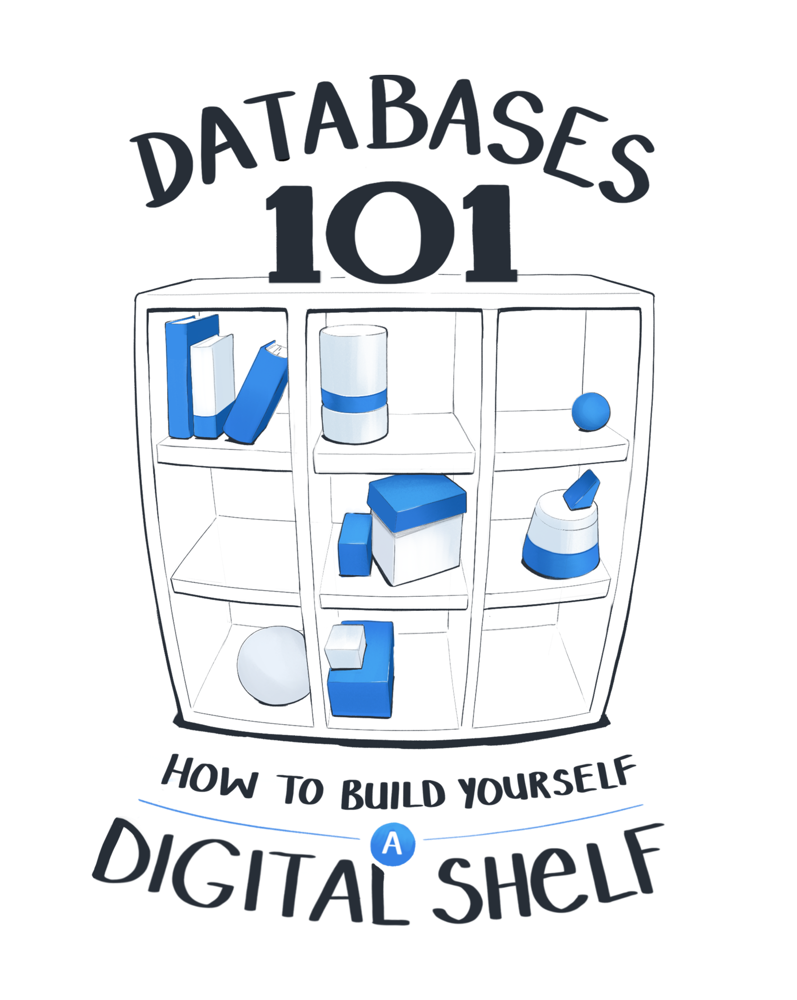
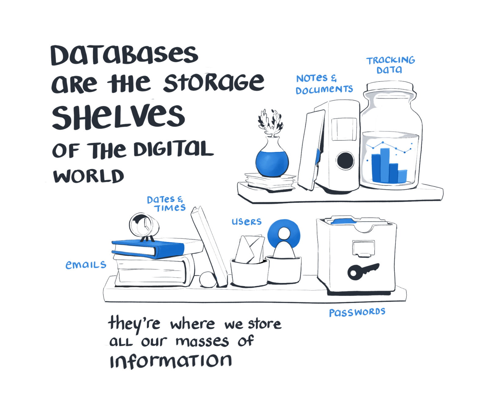
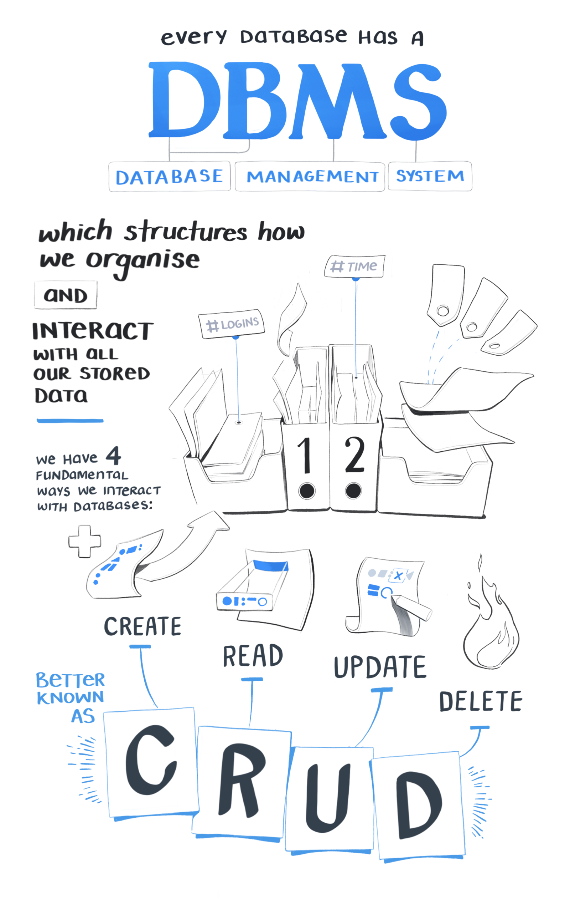
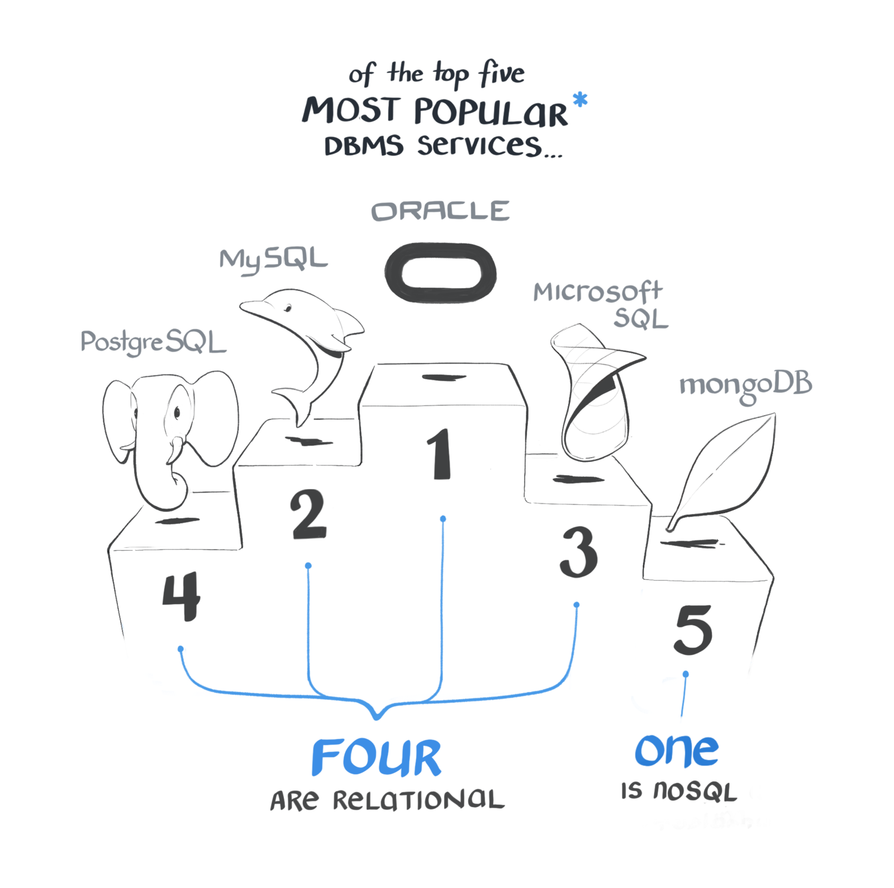

----

##### Keep Learning 

* <TooltipLink to="https://egghead.io/courses/sql-fundamentals?rc=272bjb">SQL Fundamentals</TooltipLink> course with Tyler Clark

* <TooltipLink to="https://egghead.io/courses/get-started-with-postgresql?rc=272bjb">Get Started With PostgreSQL</TooltipLink> course with Brett Cassette

##### References 

* <TooltipLink to="https://medium.freecodecamp.org/nosql-databases-5f6639ed9574">Basics of NoSQL Databases</TooltipLink> by freeCodeCamp

* <TooltipLink to="https://thomaslarock.com/2018/07/databases-101/">Databases 101</TooltipLink> by Thomas LaRock

* <TooltipLink to="https://www.sitepoint.com/sql-vs-nosql-differences/">SQL vs NoSQL: The Differences</TooltipLink> from SitePoint

* <TooltipLink to="https://www.mongodb.com/nosql-explained">What is NoSQL?</TooltipLink> from MongoDB

