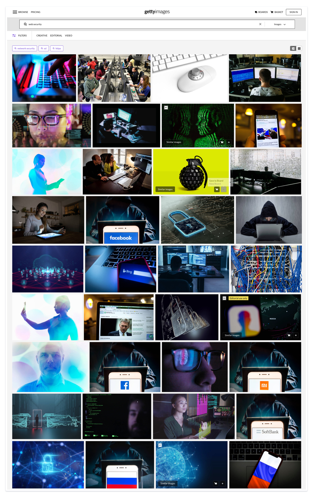
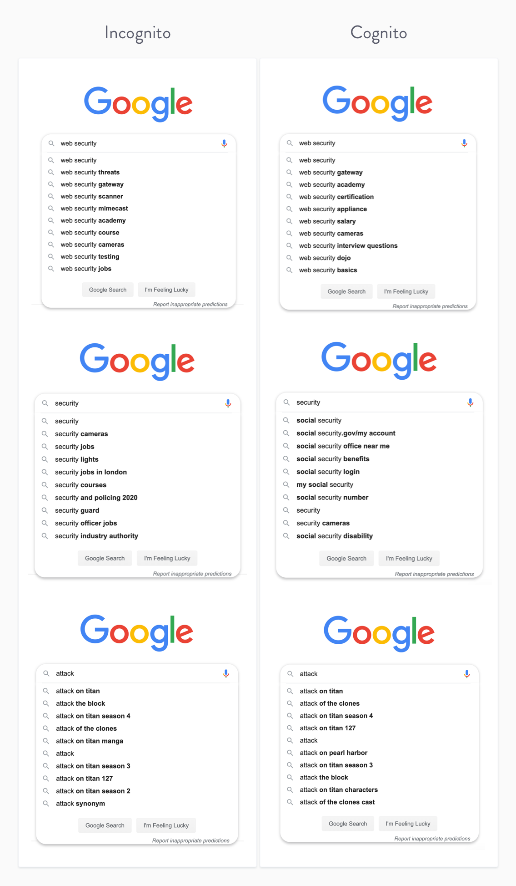

import MultipartIntro2 from './MultipartIntro2.js'

<MultipartIntro2 />

 
 

 Welcome back to the metaphorical journey.  If you haven't read Part 1, I recommend you <a noTip href="/drawinginvisibles1">head there first</a>. It gives you a solid understanding of how visual metaphors work – which will come in handy now that we're ready to design our own.

Our current case study is based around making an illustration for <a href="https://twitter.com/mikesherov">Mike Sherov</a>'s course on <a href="https://egghead.io/courses/web-security-essentials?af=54fd64">Web Security Essentials</a>. Let's quickly refresh on our big, overarching goal:

> Create an illustration that clearly communicates the idea of "Web Security"

We've established that *Web Security* is not a single physical _thing_ we can point to and sketch out on a bit of paper. It's instead an abstract, amorphorous, evolving blob of cultural concepts. And we're going to need to find a good **metaphor** to represent that cultural blob.

Our first order of business here is **cultural research**.

---

## Thinking like an Anthropologist

We often think illustration is all about drawing shapes and painting colours. Everyone wants to dive into putting pencil to paper, stylus to tablet, and cursor to vector point. But I want to talk about a very particular approach that's founded in __cultural anthropology__. It's probably not a common approach, but I'm coming at this from a weird angle.

I have <b>no legit qualifications in design or illustration</b>. My bachelor's degree and <a href="https://www.ucl.ac.uk/anthropology/study/graduate-taught/digital-anthropology-msc">upcoming master's degree</a> are both in Cultural Anthropology.<Footnote idName={1}>Cultural anthropology is not the sort related to digging up neanderthals (that's archaeology). It's instead the comparative study of all human cultures. The field is a sincere effort to learn from as many cultural approaches to life as it can, in order to apply that broad wisdom to the problems of how to live. Or as <a href="/anthropology-matters">Tim Ingold</a> puts it, it's "philosophy with the people in it"</Footnote> I spend far more time wading through academic papers on reification and gift economies than I do studying colour theory.
 

I started intensely studying illustration and traditional drawing in my early twenties because I feel a deep urge to explain cultural concepts and social science theory visually. I've always been resentful of the text-centric attitudes of our educational systems, and felt I was missing out on an essential form of communication. Despite attending plenty of "art classes" in school, no one ever taught me the nuts and bolts of technical drawing, or how to express ideas in 2D space through graphic relationships. I expect you had a similar experience. This feels absurd given how much we obsess over teaching children to spell and correctly place verbs in sentences, but I won't turn this into a rant about narrow-minded literacy education.

The point is I believe design and illustration are essential skills in the way writing and reading are.  They should compliment other skill sets. I consider myself an anthropologist who knows how to design, illustrate, read, and write, rather than a designer, illustrator, writer, or reader who knows anthropology.  Publicly I present myself as a designer and illustrator because no one posts job openings for anthropologists.<Footnote idName={3}>Except the US military if you're into studying effective methods of social shaming and developing psychological torture techniques.</Footnote>

Given this background, I'm more interested in exploring the *cultural symbols and narratives* around an idea I want to illustrate, rather than the illustration process itself. Not all illustrators will think or work this way, so know that you're get a very anthropologically-biased view of how to make an image. 

---

## Mapping the Cultural Landscape

When you read the words '_Web Security_', your brain fires off a whole host of neurones based on times it's seen that phrase in the past. Every time you watched a talk, had a conversation, or read an article that involved the idea of _web security_, it created a synaptic connection between sets of neurones. It probably linked up with neurons that hold your understanding of a _password_, _hacker_, and _firewall_. These associations are now hardwired into your brain. You cannot think about _web security_ without triggering those associated maps of meaning.

If you and I run in the same cultural circles (english-speaking, technically literate, generically Westernised, web development nerds), we'll have encountered many of the same public figures, historical events, films, articles, and public opinions related to web security. Our mental maps are probably alike. They won't be exactly the same, but I assume you know what 4chan, QAnon, are. <Footnote idName={4}>This is an assumption I'm making as a creator that is obviously problematic, and always has been. The audience is always an imagined blob of people I have to make educated guesses about. This is just as true with illustration as it is with writing.</Footnote>

The *cultural messages and meanings* beneath images are what fascinate me. 

This anthropological form of illustration is a way of doing [Semiotics](https://en.wikipedia.org/wiki/Semiotics) - a fancy anthropological word for the study of signs and symbols.

Humans will turn everything and anything into a symbol.  
Nothing is what it seems.  
Cereal choices are socio-economic markers.   
Shoes are political affiliations.  
Emojis have four layers of sub-text. 🐝 🍆 🐐 ❄️

Whatever concept we're trying to meaningfully communicate, it comes pre-baked with a set of symbolic associations that we need to pay attention to.

Your audience does not live in a void. They, like you, are active members of a cultural world that is constantly creating and passing around a stream of symbolic concepts in the form of buzzwords, technical jargon, tweets, overly opinionated reddit comments, icons, illustrations, memes, GIFs, and bad stock photos. It's [The Zeitgeist](https://en.wikipedia.org/wiki/Zeitgeist).

Our task is to __map out the cultural field__ to get a genuine understanding of what our intended audience associates with the concept.

Finding the right visual metaphor is a glorious scavenger hunt through language, iconography, and cultural connections.

### Mapping the Cultural Landscape

Idea dumping is the best way to ...

What this looks like is a freewheeling list of associated words and concepts.

At this point I open up Procreate on my iPad Pro and create a new blank canvas
It's 4000 x 5000 pixel at 144dpi(2) – this gives me a ton of open space to work in. Nothing worse than running out of imaginary digital paper.

(2) The size and dpi of this canvas make absolutely no difference to the quality of the brainstorming we're about to do but someone is going to ask 😉

I start jotting down all the obvious associations that immediately come to mind: 

- Hacking, the dark web, protection, DDOS, click attacks, man in the middle attacks, honeypot wifi, firewalls, breaching systems, botnets, zero day vulnerabilities, exploits, phishing, malware, ransomware, bitcoin ransoms, spoofing, trojan horses, VPNs, white-grey-black hats, password dumps, password cracking, cryptography, algorithms, cookies
- Picking locks, skeleton keys, lock picking kits, padlocks, bike locks, security shutters, Fingerprints, scanners, secure buildings, swipe cards, lanyards, grates over windows, Baby pens, Baby monitors, Walkie talkies, Alarms and alert systems with laser triggers, Guard towers and watch towers, Tube security gates 
- Cracking open a nut, Cracking open a shell, Crab shells, Turtle shells, Fishing nets capturing cookies and fish passwords, Fishing hooks and spears
- Breaking in, breaking glass, smashing windows, disabling, turning off systems, glitches, slipping underneath, blowing it all up, shelter, cover, umbrella, raining attacks, Castles, bricks, thick walls, moats, scanning the landscape, watch towers, fire, torches, great wall of china, signals, catapults, medieval armoury, forts, 
- Shields, barriers, bullet-proof vests, Knights, swords, horses, jousting, Bow & Arrows, arrows in a shield, robin hood, target practice, nail on the head, arrow in the apple, firing click-arrows, guards, Buckingham palace, the panopticon, gates, wrought iron, monitoring, watching, eyes, police, TSA, metal detectors, CCTV cameras, surveillance, warning signs, lasers, MI5, recording devices
- Immunity – immune system, inflammation, disease, cancer, T cells, viruses, microscope images of bacteria, infections, antibiotics, vaccinations

What we're doing here is laying out **a conceptual map** to explore.

It's pretty good but there's one issue with it.  
It's only _my_ assocations with "Web Security."  
And this illustration isn't for me. It's for _you_.

Maybe you personally.  
But in a generalised sense, the large lovely community that revolves around egghead.io and the world of web development.  
It needs to yell "I am about Web Security!" to everyone that sees it.

This requires cultural research. Which is where this gets fun. 

## Part Three - Cultural Ethnography

If we want to find out the general cultural conceptions around "Web Security," we head to the native watering holes of the internet - Hacker News,reddit, and twitter.
What I'm looking for are overarching cultural tropes, touchstones, and metaphorical language.

[r/cybersecurity](https://www.reddit.com/r/cybersecurity/)
[r/websecurity](https://www.reddit.com/r/websecurity/)

Some things that jump out – "penetration testing" "risk management" "secure field login" "third-party vendors" "XSS" "vulnerability" "injection"

Overall noticing empahsis on entry points like login forms. It's noticing we speak about websites as contained objects that have physical boundaries and vulnerable entryways into that container.
Chinks in the armour. Gatewatys into the fortness. Cracks in the walls. Underground tunnels into mission control. Injections into the human body - our skin is our container.

### Language Analysis

I am a huge nerd for linguistic analysis tools. These are like a thesaurus on steroids.

<TwoCol>

#### [OneLook](https://www.onelook.com/thesaurus/)

#### [TV Tropes]()

A quick search on here turned up [security blankets](https://tvtropes.org/pmwiki/pmwiki.php/Main/SecurityBlanket), [overreactive TSA agents](https://tvtropes.org/pmwiki/pmwiki.php/Main/OverreactingAirportSecurity), [laser hallways](https://tvtropes.org/pmwiki/pmwiki.php/Main/LaserHallway), and [magical CCTV cams](https://tvtropes.org/pmwiki/pmwiki.php/Main/MagicalSecurityCam)

</TwoCol>

#### [iWeb English Corpora](https://www.english-corpora.org/iweb/)

First, I'm sorry about this one. Someone built this website back in 1994 and hasn't touched it since.  The UX is a horror show and I only understand 37% of how it works.  That 37% is well worth it though.

// Video voiceover of searching on it. 

At this point I have a very generic form in my mind of some kind of __container__ that has __defined boundaries__ and __vulnerable entry points__

It's a rough image in my mind but it's a base set of conditions to build a visual metaphor off.

* The human body
* A gated fortress / secure building
* A biological cell
* Locked box

While doing all this research and idea generation I open up a new blank canvas on my iPad and start loosely jotting down all the themes and visual ideas I'm stumbling across. 

It's words from the idea dummp list, small icons that relate to them

All the beginning sketches are quite typical and tropey - padlocks, keyholes, and web browsers. The kind of standard imagery you find by [googling web security]()

This stuff is still important to get down on the page. If this is what jumps to mind for most people it clearly holds strong visual power. A worthwhile base to build off.

 

## Functions

## Qualities

<SimpleCard width="740px">

### Endnote

What I have described above is an extensive process that is extreme overkill if you're just sketchnoting some basic JavaScript concepts.

It's deep research for the joy of it. I recommend it as a enthusiastic hobby, and not a requirement if any of this sounds like "work" to you. YMMV

</SimpleCard>

---

## [Read Part 3](http://localhost:8000/drawinginvisibles3)