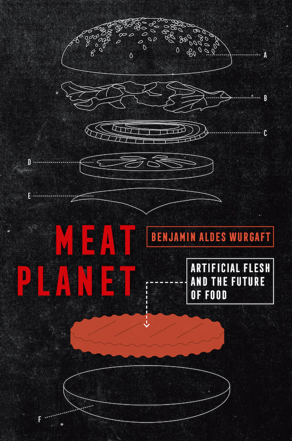
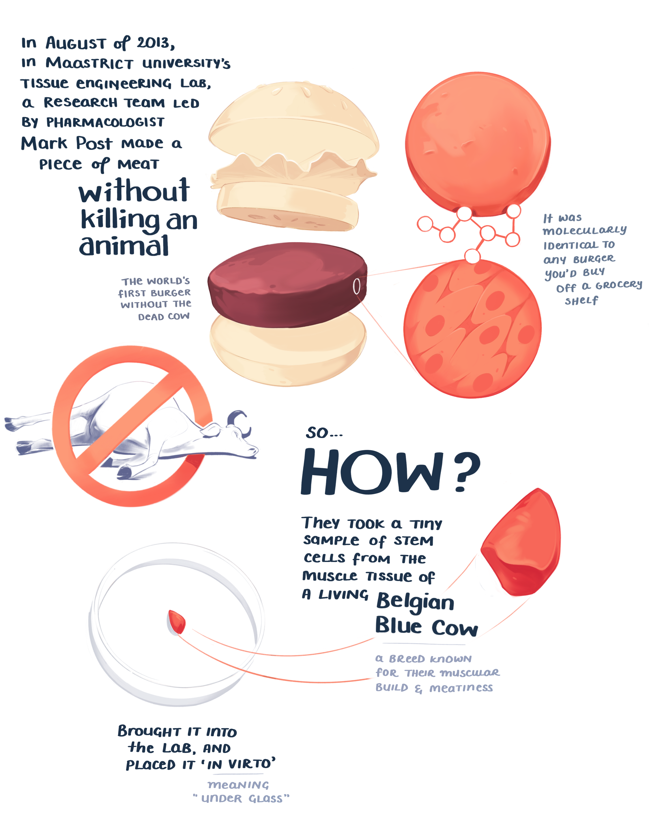
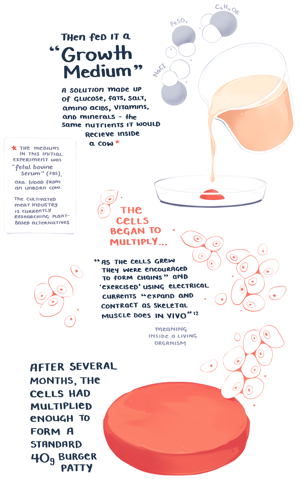
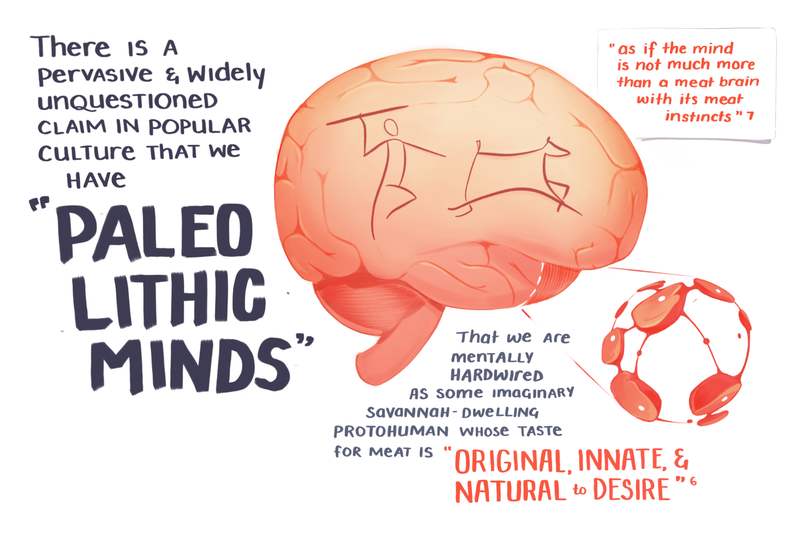
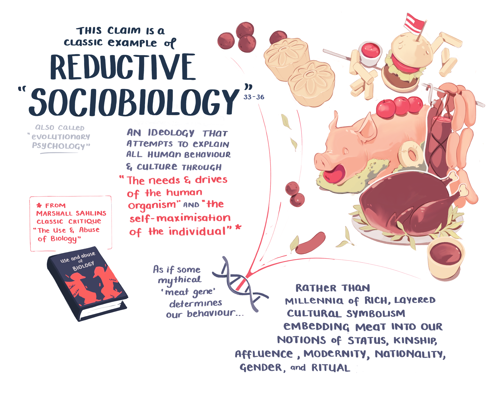
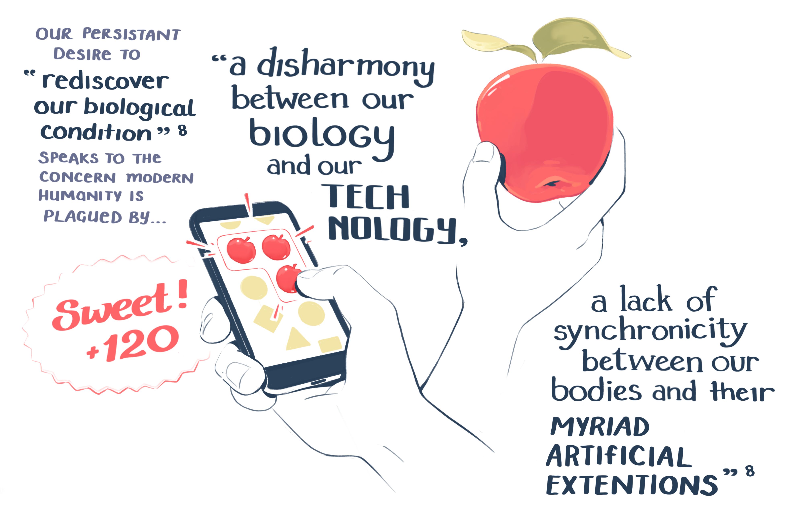
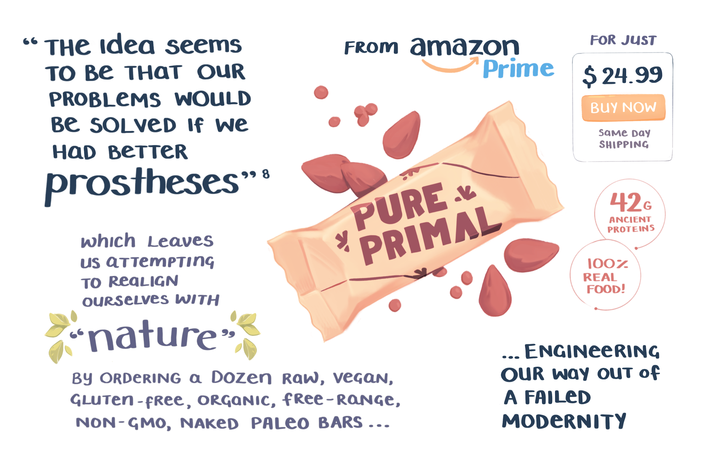
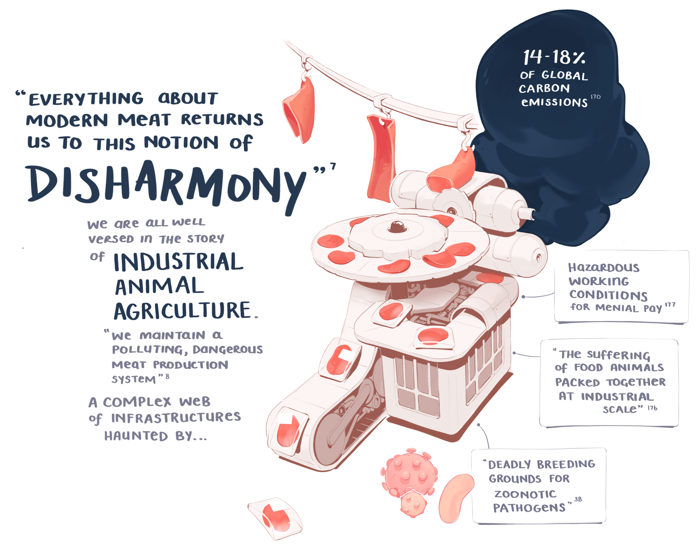
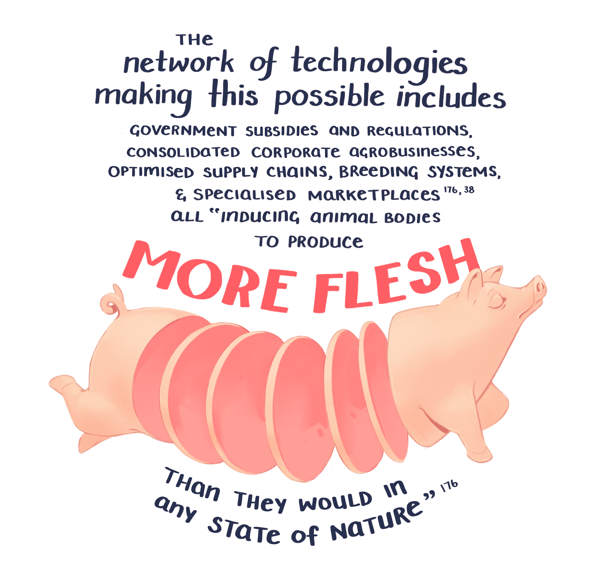
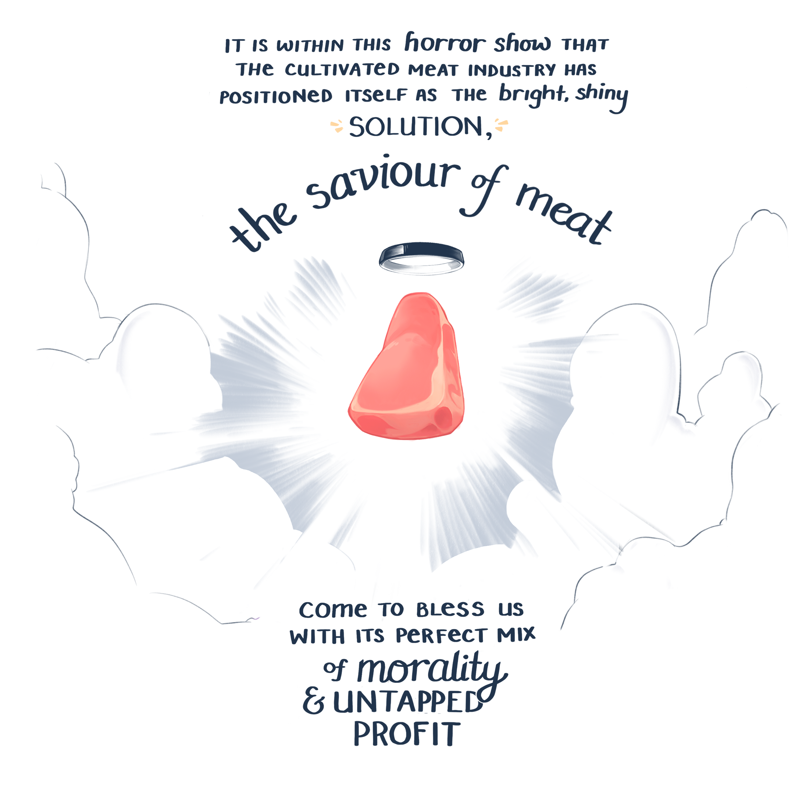

You might have noticed the content on this site spans the full array of my weirdo interests and niches. Cultivated meat is certainly part of that equation. 

If you've never heard of *cultivated meat*, this will be a great primer

## A series of illustrated notes on the book "Meat Planet" by Ben Wurgaft.

<TwoCol>

### Meat Planet: Artificial flesh and the future of food

#### by Ben Wurgaft

Meat Planet explores the quest to generate meat in the lab—a substance sometimes called “cultured meat”—and asks what it means to imagine that this is the future of food.

</TwoCol>

Coming across Ben Wurgaft's book 'Meat Planet' was a special thrill for me.

I'd been following the media hype around the promise of 'cultivated meat' 1 since early 2017. Mostly as a curious layperson who indulges in reading Silicon Valley techno-utopian gossip the way others watch Keeping Up with Ru Paul's Real Housewives of Love Island.

I was primarily drawn to the cultural implications of the idea. Seen through an anthropological lens, cultivated meat prompts a series of fascinating questions;

What do we mean by 'natural' and 'unnatural', 'real' and 'fake'?
Why do some people react to the idea with disgust and revulsion? What makes us culturally categorise things as 'icky' and 'gross'?
How do we define the categorical boundaries and rules around food, and how malleable is that framework?
Since most of the discussion was happening on Hacker News and Twitter (not usually founts of philosophical reflection), I didn't expect anyone to meaningfully explore these questions.

The chatter instead orbited around short-term technological viability, or time-to-market, or IPO stock price speculations of hypothetical products.

I was then thrilled to see an anthropologist & historian step into the ring among all the TED-talky-thought-leadering-VCs.

Ben approached the topic through a series of wide-scale historical, cultural, and sociopolitical questions on the nature of what meat is without the dead cow involved. He uses the promise of animal-free meat as a jumping off point into deeper historical trends about scientific ideologies, Calvinistic Capitalism, and the presumed division of nature and culture.

Ben's neutrality is a large part of what makes this a good read - he's not for or against it, he's curious.

His agenda is to make you think on a very different level than the mountain of Wired articles on the topic. And he's asking way better questions than when can I buy it?, will it give me cancer?, and what will do we with all the cows??

Reading this book was akin to having a far more intelligent and academically informed companion take my half-formed pedestrian observations and flesh them out into high-definition, coherent scenes.

Needing an outlet for my weird over-enthusiasm, I started working through my notes on the book and picking out the best morsels to turn into illustrated frames.

Be warned they're not a comprehensive summary of the book.
They're selected snippets filtered through my own research interests and curiosities. With a good dose of extra commentary layered on top.
If they pique your interest, I promise there's plenty more meat in the actual book.

---

Last winter I read <a to="#">Ben Wurgaft</a>'s book <a to="#">Meat Planet</a>

