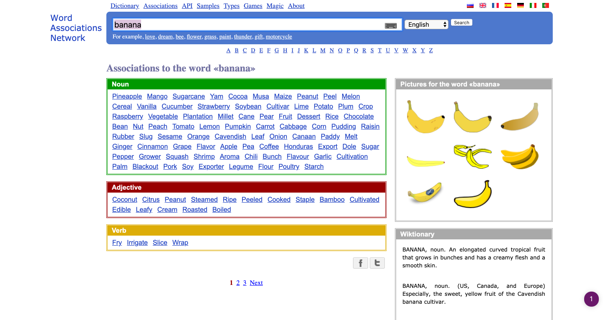

Using linguistic analysis tools is one of my favourite techniques for [Metaphor Design](/mwlb).

[OneLook](https://www.onelook.com/thesaurus/)

---

[Word Association](https://wordassociations.net/)

---

[Phrase Thesaurus](https://www.phrases.org.uk/phrase-thesaurus/search/index.html)
Just like it sounds, it find phrases based around whatever keyword you type in

---

[iWeb Corporea Search](https://www.english-corpora.org/iweb/)
The academic beheamoth of the bunch, this one is slightly intimidating but undeniably powerful. Because the terrible UX.

---

[Etymology Dictionary](https://www.etymonline.com/)

