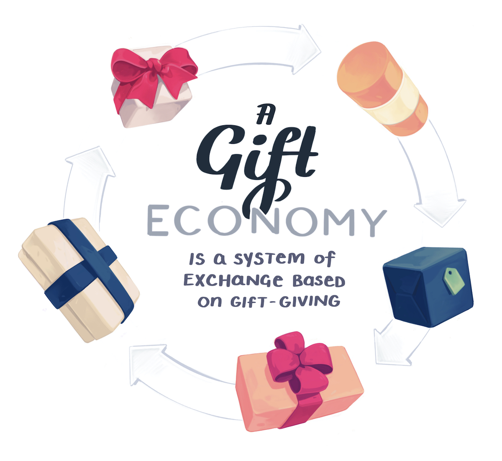

Gift economies are a system of exchange based on gift giving. Valuables are systematically given without explicit agreement of future rewards within a contained community of people.

Gift economies are generalised, non-specific, non-linear, indirect, and delayed.

The emphasis in a gift exchange is on strengthening the both between the giver and receiver. It creates a kind of "positive debt," where the two people are now tied to one another.